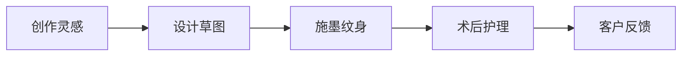
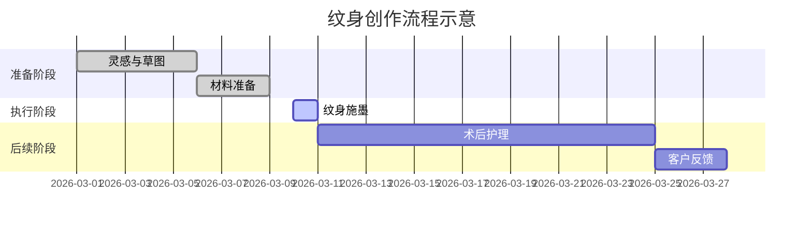

# 执行摘要  
当前网站「画廊」页面仅以图片网格展示纹身作品，缺乏任何文字说明、分类或互动提示，难以让访客理解每件作品背后的故事和意义。我们建议采用分层布局（按风格或主题分类）、为每幅作品添加详细故事页面，并增加艺术家简介、客户评价等内容来丰富信息【19†L329-L336】【19†L370-L375】。针对每件作品，建立包含“标题–引子–创作背景–象征意义–客户故事/情感–技法说明–护理提示–CTA”的故事模板，配合中英示例短句，能让欧美客户产生共鸣。报告提供5个不同风格的中英文示例故事（每篇中文约200–350字），以及图片与文字排版、交互设计建议（响应式布局、字体/行距规范、悬停提示、展开阅读、图标/时间线等）。社媒方面，给出适用于Instagram/TikTok的图文摘要模板和30–60秒短视频脚本示例（中英），并列出SEO关键词与推荐标签。最后推荐使用Stitch设计原型、Cursor辅助编码，结合WeGlot或类似工具实现多语言，集成预约系统（如Calendly/Typeform），部署到云端并利用Lobster（OpenClaw）AI代理自动化社媒营销和客户跟进【25†L25-L32】【22†L130-L134】。输出包含不同建站方案的优缺点对比表和成本估算，以及必要的示意图与可复制文案片段。  

## 当前画廊页面问题与改进建议  
从截图可见，你在Stitch中编辑作品集的“画廊(Gallery)”页面，页面以黑色背景网格展示6张纹身图片（“Gallery, Videos, Tagged”三栏），且当前选中“Gallery”标签。右键菜单（复制为代码/复制到Figma/复制为PNG）表明你可能正在导出页面或原型代码。页面仅展示图片缩略图，没有任何标题、文字说明或链接，访客无法了解每张作品的含义、创作故事或预约方式；同时缺乏多语言切换和明显的“预约”按钮，SEO（如图片alt文本）也未优化【46†L169-L175】。这样的纯图模式在信息传达上过于单薄。  

**改进建议：** 优秀的作品集网站通常会对作品进行分类展示，并配以简短说明【19†L329-L336】【19†L370-L375】。建议将作品按风格（如黑灰、水彩、日式元素等）或主题分类，访问者可通过标签或导航筛选。每幅作品应链接到独立的故事页，在其中添加标题、设计灵感、象征意义等文本内容；配合创作草图、顾客反馈和高质量图片来呈现创作过程【19†L353-L362】。同时，在首页或侧边栏加入艺术家头像及简介，展示资质和个性风格。页面应增强交互性，例如鼠标悬停时显示作品标题、点击展开详细介绍等。为了吸引欧美客户，需要提供中英文版本：可使用如WeGlot的多语言插件，自动翻译元数据并助力SEO【22†L130-L134】。此外，要突出“预约”按钮（如固定在可见位置），并使用清晰直观的文字引导客人下单（例如“立即预约纹身”）。通过这些改进，可使访客在浏览画廊时迅速抓住重点，了解每件作品背后的情感和故事，从而提升联系转化率【19†L370-L375】【46†L169-L175】。

## 故事结构模板  
为让作品故事既丰富又有条理，可采用以下模块化结构，每部分都编写具体内容并对应中英示例：  

- **标题（Title）**：一句点题的标语或作品名，体现主题和情感。建议长度约8–12汉字（英文10–15词）。  
  - 示例：`樱花英魂：重生的勇士` / *“Cherry Blossom Valor: A Warrior Reborn”*。  

- **引子（Hook/引导句）**：一句简短描述，引出故事背景。建议30–50字（英文20–30词）。  
  - 示例：`“这朵盛开的樱花，来自战友在生命尽头许下的承诺。”` / *“This blooming cherry blossom comes from a promise made between comrades.”*  

- **创作背景**：说明作品灵感来源和创作契机。建议50–80字（英文40–60词）。  
  - 示例：`旅居东京的李先生在一次樱花祭上偶遇战友，两人重逢的情景触发了灵感。他决定将那份守护与思念化为纹身，于是诞生了这幅作品。` / *“While living in Tokyo, Mr. Li reunited with a comrade at a cherry blossom festival. Inspired by that moment of protection and longing, he decided to turn it into a tattoo.”*  

- **象征意义**：解释图案中元素的寓意。建议50–70字（英文40–50词）。  
  - 示例：`樱花象征新生与脆弱，战甲则代表坚韧和奉献。两者结合寓意“在绽放的人生里永远铭记牺牲与荣耀”。` / *“The cherry blossom symbolizes renewal and fragility, while the armor stands for strength and sacrifice. Together, they mean ‘even in life’s bloom, never forget sacrifice and honor.’”*  

- **客户故事/情感共鸣**：讲述客户与纹身的情感关联。建议80–120字（英文60–100词）。  
  - 示例：`张先生是一名前海军陆战队员，这纹身是为纪念牺牲战友而来。他说，每当看到纹身，就仿佛那个兄弟还站在身边，一起守望东京的樱花。` / *“Mr. Zhang, a former marine, got this tattoo in honor of his fallen comrade. He says that whenever he looks at it, it’s as if his brother is still standing by his side, watching Tokyo’s cherry blossoms together.”*【46†L219-L224】  

- **技法说明**：简述纹身风格或技术特色。建议30–50字（英文20–40词）。  
  - 示例：`本作品结合写实与新派手法，用柔和粉色描绘樱花，用粗犷线条和灰调突出武士盔甲金属感。` / *“This piece blends realism with neo-traditional style: soft pinks color the blossom, while bold lines and gray tones accentuate the warrior’s armor.”*  

- **护理与预约提示**：提供术后护理建议并提醒预约方式。建议20–40字（英文15–25词）。  
  - 示例：`请保持纹身部位清洁湿润，定期涂抹无刺激保湿液。更多护理信息见帮助文档。` / *“Keep the tattoo clean and moisturized with a gentle lotion. See our care guide for more tips.”*  

- **CTA（号召性用语）**：一句鼓励读者行动的结尾，如预约。建议5–8字（英文3–5词）。  
  - 示例：`“立即预约纹身”` / *“Book Your Tattoo Now”*。  

编写时注意使用温暖真诚的口吻，不要生硬推销。短小故事有助于情感连接【46†L219-L224】，每段文字可独立成章，并在页面中通过标题或图标区分。以上模板可根据具体作品自由组合，确保中英文版本信息一致。

## 示例故事（中英对照）  
下面给出5个不同风格的示例故事，每个先提供中文，再附对应的英文翻译：  

**示例1：樱花勇士**  
张女士是一位美国留学生，深深爱上了日本文化。她的纹身将盛开的樱花与武士形象结合，寓意“爱与勇气并存”。纹身灵感来自她在东京偶遇一位和服武士扮演者：樱花象征短暂的美好，武士代表忠诚与力量。这两者结合寓意在生命绽放时也铭记牺牲与荣耀。作品采用写实与新派结合风格，樱花用柔和粉彩，武士盔甲以金属灰色突显质感。张女士说，每当看到纹身，就像拥有了一位守护神。纹身完成后，她非常满意，觉得它让自己与日本文化更加紧密相连。  
**English:** Ms. Zhang, an American student, fell in love with Japanese culture. Her tattoo combines a blooming cherry blossom with a samurai figure, symbolizing “love and courage together.” The design was inspired by a chance encounter in Tokyo with a kimono-clad samurai performer: the cherry blossom stands for fleeting beauty, and the samurai for loyalty and strength. Together they mean that even in life’s bloom, we remember sacrifice and honor. The piece blends realism with neo-traditional style: soft pastel pinks color the blossom, while the warrior’s armor is shaded metallic gray for a rugged feel. Ms. Zhang says that when she sees this tattoo, it feels like she has a guardian spirit with her. After it was finished, she was very pleased and felt it made her feel more connected to Japanese culture.  

**示例2：莲花静谧**  
来自欧洲的凯文先生热爱自然，他的纹身以莲花为主题。莲花出淤泥而不染，象征纯洁与重生。创作灵感源于凯文一次登山之旅：在山顶湖畔迎接晨曦时，他决定将那份宁静带回生活。纹身采用水彩风格，色彩柔和明亮。粉色和淡紫色的渐变营造出梦幻氛围，花瓣边缘留白仿佛水墨晕染。凯文表示，每次触摸皮肤仿佛能感受到清晨湖水的凉意，让他在忙碌生活中找到内心宁静。这次纹身也激励他坚持追求内心的平和与梦想。他非常喜欢这件作品，希望它能陪伴他未来的人生旅程。  
**English:** Mr. Kevin from Europe loves nature, and his tattoo features a lotus flower. The lotus, rising pure from the mud, symbolizes purity and rebirth. He was inspired by a mountain hike: at sunrise by a mountain lake, he felt profound calm and wanted to bring that tranquility into his life. The tattoo is done in a watercolor style with gentle, bright colors. Gradients of pink and pale purple create a dreamy atmosphere, and the unfilled edges of the petals mimic an ink-wash effect. Kevin says that every time he touches his skin, he feels the cool morning lake air, helping him find inner peace amid a busy life. This tattoo also motivates him to keep pursuing inner peace and his dreams. He loves this piece and hopes it will accompany him on his life’s journey.  

**示例3：几何狮心**  
艾琳是法国摄影师，这款纹身选用了狮子的头像和几何线条拼贴。狮子代表王者与守护，几何图形寓意秩序与平衡。她希望作品融合勇敢和理性的元素。灵感来自她北非旅行时见到的沙漠与夕阳：广阔的沙漠和金色夕阳让她联想起内心的热情与坚毅。作品以黑灰色调为主，几何阴影增强了艺术效果；狮子眼睛留白更显神秘。艾琳说，这纹身激励她勇敢探索未知，同时保持内心的冷静。完成后，她微笑着表示非常满意，觉得这件作品既充满力量又让人深思。  
**English:** Aileen is a French photographer, and her tattoo combines a lion’s head with a geometric collage. The lion stands for royalty and protection, and the geometric shapes symbolize order and balance. She wanted the design to blend courage and reason. The inspiration came from her trip to North Africa: the endless desert and golden sunset there reminded her of inner passion and strength. The tattoo’s colors are mainly black and gray, with abstract geometric shading adding an artistic touch; the lion’s eyes are left uncolored for mystery. Aileen says this tattoo inspires her to bravely explore the unknown while keeping calm inside. After it was completed, she smiled and said she was very pleased—this piece is both powerful and thought-provoking.  

**示例4：鹰之守护**  
田先生为纪念已故父亲而纹身。这是一个纪念父亲对鹰的热爱的设计：展开的鹰翅下缠绕着印第安图腾式图案。他告诉我们，父亲年轻时热爱徒步，经常说“坚强如鹰，一飞冲天”。纹身中间的鹰目光坚毅，周围褐色和金色的羽毛细节展现出力量感。鹰象征自由和勇气，图腾代表智慧与传承。纹身师采用细腻的阴影刻画羽毛，让图案更具立体质感。田先生说，每次看到这纹身就仿佛父亲仍在守护自己。他对这件作品非常满意，希望它能长期陪伴自己。  
**English:** Mr. Tian got a tattoo in memory of his late father. The design honors his father’s love of eagles: under the spread wings of an eagle, Native-style totem lines weave around. He told us that his father loved hiking and often said, “Be strong as the eagle – soar high.” In the tattoo, the eagle’s eyes look determined, and the brown and gold feather details convey power. The eagle symbolizes freedom and courage, while the totem represents wisdom and heritage. The tattoo artist used fine shading to depict the feathers, giving the design a three-dimensional feel. Mr. Tian says that whenever he sees this tattoo, it’s as if his father is still watching over him. He is very happy with the piece and hopes it will accompany him for life.  

**示例5：诗意人生**  
索菲亚是一位艺术工作者，她想把喜爱的诗句纹在身上。图案是中文书法“流水落花春去也”，旁边点缀荷叶和浅蓝色涟漪。行书字体流畅飘逸，墨色浓重深沉。荷叶和涟漪增添了诗意意境。纹身师用几何风格的蓝色水纹背景搭配文字，整体色调清新柔和。完成后，索菲亚非常满意这件充满诗意的作品。每次触摸纹身肌肤，都仿佛在温润的春风中漫步，这让她更加珍惜眼前的每一刻。她说，这句诗一直激励她勇敢前行，铭记生命的美好与无常。  
**English:** Sophia, an artist, wanted to tattoo a favorite poem on her body. The design uses Chinese calligraphy “流水落花春去也” (“Flowing water, falling blossoms – spring passes away”), accompanied by lotus leaves and pale blue ripples. The cursive script is fluid and elegant, with deep ink strokes. The lotus and water waves add a poetic atmosphere. The tattoo artist paired the text with a geometric blue water-pattern background, creating a fresh and gentle color scheme. After it was finished, Sophia was very pleased with this poetic piece. Every time she touches the tattoo on her skin, she feels as if she’s walking in a warm spring breeze, which makes her cherish the present moment all the more. She says this line has always inspired her to move forward bravely, remembering life’s beauty and impermanence.  

## 图片与文字排版与交互设计  
在页面设计上，要兼顾桌面和移动端体验。**布局**上，桌面端可以采用左右分栏：左侧展示高分辨率作品图片，右侧为文字故事内容（或上下滚动切换），突出重点；手机端则用单列垂直滚动，方便在小屏上逐段阅读。**字体与行距**建议正文使用无衬线字体（如苹方/Roboto），标题使用稍大号字体（24–32px），正文16–18px；行高1.5左右，段前段后留空，使文本易于阅读。色彩上保持较高对比度，例如深色文字搭配浅色背景；若背景是图片，可在文字区加半透明背景板。**交互与可视化**上，每张作品缩略图可设置鼠标悬停时显示标题或简短说明，点击后弹出或跳转至故事页。在故事页内部，可在各部分前用图标（如灵感灯泡、心形等）标识对应内容；将创作步骤制作时间线或流程图（见下图示例），让用户直观了解流程；对关键关键词加标签（如“黑灰风格”、“写实”）并可点击过滤；在长文本后添加“展开阅读/收起”按钮，提升移动阅读体验。*示例流程图：*  





**提示：** 确保“立即预约”按钮在页面显眼位置（可用亮色），按钮文案例如“立即预约纹身”（英：“Book Your Tattoo Now”）。所有图文元素应适配响应式布局【46†L169-L175】，在移动端保持清晰和加载速度。  

## 社交媒体摘要模板与短视频脚本示例  
- **社交媒体图文摘要模板（中/英）：** 包括**情感引导 + 作品亮点 + 号召行动**。例如：  
  - **中文示例：** “【今日故事】樱花与武士——爱与勇气的融合。每朵盛开的樱花都承载着守护的力量，纹身师@店名 创作了一段温暖的纪念故事。💖 想了解设计背后的灵感？点击链接预约体验吧！”  
  - **English Example:** “**New Story Alert:** Cherry Blossom Samurai – a fusion of love and courage. Each blooming sakura here carries protective power, woven into this touching memorial design by @StudioName. 💕 Want to learn the inspiration behind it? Click the link to book your own experience!”  

- **Reel/TikTok脚本示例（30–60秒）：** 短视频应分阶段呈现：  
  1. **开头钩子（0-5秒）：** 展示纹身特写或设计稿，画外音说：“猜猜这个纹身背后有什么故事？”（*VO:* “Guess the story behind this tattoo?”）  
  2. **过程展示（5-45秒）：** 快速切换设计草图、刺青过程、客户微笑等画面，同时语音或字幕讲解故事要点：例如：“这款樱花武士纹身来自@顾客姓名的真实故事：盛放的花朵纪念逝去的战友，而武士代表坚守与荣耀。”（*VO:* “This cherry blossom samurai tattoo comes from @Client’s real story: the blooming flower honors a fallen comrade, and the samurai represents steadfast honor.”【46†L122-L129】）  
  3. **结尾号召（45-60秒）：** 展示完成作品和纹身师微笑，字幕/口播：“想定制你的专属纹身故事吗？点击预约，一起创造下一个传奇。”（*VO:* “Want your own custom tattoo story? Click to book a session with us!”）  

此脚本结构符合社交媒体特性：开头3秒抓住眼球，中段通过视频与故事加深印象【46†L122-L129】，结尾明确CTA。发布时可添加热门音乐、字幕和店铺Logo，频率建议每周更新2-3次。  

## SEO与关键词建议及社媒标签  
- **SEO关键词（中英）：** 结合纹身客户搜索意图，页面标题和正文应包含“东京纹身”、“东京纹身店”、“定制纹身”、“日本纹身艺术”、“艺术纹身设计”等中文关键词，以及“Tokyo tattoo studio”、“custom tattoo Tokyo”、“Japanese tattoo artist”、“meaningful tattoo story”等英文关键词【14†L25-L28】。例如标题可写成《Tokyo Custom Tattoo｜东京定制纹身艺术》，元描述加入以上关键词。所有图像需填写描述性alt文本（如“Cherry blossom forearm tattoo”），以提升可访问性和搜索排名【46†L169-L175】。  

- **Instagram/TikTok标签：** 使用热门与定位标签结合【52†L168-L172】【52†L191-L199】。英文常用标签如 `#tattoo #tattoos #inked #TattooArtist #TokyoTattoo #JapaneseTattoo #InkArt #TattooLife #CustomTattoo` 等；中文标签可用 `#东京纹身 #刺青艺术 #纹身设计 #日式纹身 #纹身师`。地理标签（如 `#Tokyo #Japan`）有助于本地化曝光【52†L168-L172】。根据平台规范，Instagram可添加10–15个标签，TikTok可选3–5个相关话题。  

## 推荐工具/平台与工作流程  
- **Stitch (设计原型)：** Google推出的AI界面设计工具，可快速生成网页布局原型【48†】。使用Stitch挑选参考模板后快速创建界面，然后导出为代码或设计稿。**优点：**设计迭代快，免去从零绘制；**缺点：**现阶段需手动调整和导出代码。  
- **Cursor (AI编码助手)：** 智能编程工具，可自动补全代码、审查PR等【50†L46-L54】【37†L429-L442】。通过Cursor，可加快将Stitch原型转为实际前端页面代码的过程。个人版订阅约$20/月【50†L46-L54】（包含多种AI模型访问）。**优点：**提高编码效率，支持多种编程语言；**缺点：**对新手而言依旧需要基础编程知识。  
- **建站平台/框架：** 视团队技术情况可选择不同方式：
  - **Format**：创意作品集平台，模板精美且支持多语言（内置Weglot翻译）【22†L130-L134】。**优点：**无需编码、内含SEO优化工具；**缺点：**自定义灵活性有限，需付费订阅（Pro Plus 约$15/月【32†L311-L319】）。  
  - **WordPress**：开源CMS+Elementor等可视化插件搭建。**优点：**极高灵活性、插件生态丰富（SEO、翻译、预约等）；**缺点：**需自行购买主机和维护，学习成本略高。托管费一般$5–10/月。  
  - **Webflow**：可视化设计开发平台，生成响应式网站。**优点：**拖拽式设计自由度高，对设计师友好；**缺点：**功能全面计划价格较高。  
  - **Wix/Squarespace**：易用的拖拽建站服务，包含托管。**优点：**上手快，模板丰富；**缺点：**费用较高（Wix基础约$17/月【54†L908-L911】），二次开发受限，不适合复杂定制。  
- **多语言实现：** 使用如WeGlot之类的翻译插件，可自动生成英文版页面，并带有 hreflang 标签提升国际SEO【22†L130-L134】。需要校对AI翻译结果以确保语义准确。  
- **预约系统：** 可集成第三方工具（Calendly、Typeform、或者表单插件）实现在线预约，并发送确认邮件/短信，提供客户表单和自动提醒。  
- **分析与自动化（Lobster/OpenClaw）：** 部署一个OpenClaw (又称“养龙虾”AI代理) 在云端24/7运行【25†L25-L32】。它可自动执行多步任务，例如：监控Instagram上的指定#标签，自动关注/私信潜在客户；收集网站流量与预约数据并生成报表；基于规则定期推送营销消息给订阅者。Lobster技能（如社交抓取、消息发送）结合OpenCloud主机，可极大减轻人工运营负担【25†L25-L32】【25†L39-L48】。  

```mermaid
flowchart LR
    Stitch[Stitch设计原型] --> Code[导出到Cursor编码]
    Code --> Dev[开发/定制网站]
    Dev --> Host[部署到云端 (Vercel/Tencent Cloud)]
    Host --> MultiLang[集成多语言插件]
    Host --> Booking[配置预约系统]
    Host --> AI[Lobster(OpenClaw)代理自动化]
    AI --> Marketing[社媒自动化营销]
    Host --> Analytics[集成网站分析 (GA等)]
```  

| 平台/方案          | 优点                                            | 缺点                                           | 费用估算                            |
|-------------------|-----------------------------------------------|-----------------------------------------------|------------------------------------|
| Stitch+Cursor (自建) | AI辅助快速设计与开发，高度可定制；支持双语         | 需要前端开发技能；维护成本高                     | Stitch免费；Cursor Pro ~$20/月【50†L46-L54】；服务器/域名约$5+/月 |
| Format (作品集建站) | 专业模板、易上手；内置SEO、移动优化和多语言支持【22†L130-L134】 | 功能定制有限；需订阅付费                       | Pro Plus ~$15/月【32†L311-L319】    |
| WordPress + Elementor | 极大灵活性；插件丰富（预约、SEO、表单等）；开源免费 | 需要维护和安全更新；自行购买主机和域名          | 主机$5–10/月，域名$1–2/月           |
| Webflow (可视化)  | 设计自由度高，无需后端编码；自动生成响应式网站      | 学习成本较高；高级功能和协作需付费             | 基础站点计划约$14–35/月             |
| Wix              | 拖拽式建站简单；包含托管                          | 定制能力有限；较贵，电商功能需高价计划         | 入门约$17/月起【54†L908-L911】      |

## 下一步行动清单  
- **收集素材**：整理待展示纹身作品及客户故事，撰写中英长篇故事初稿，进行翻译和校对。  
- **完善设计**：在Stitch中实现改进后的画廊原型（添加分类、说明、交互提示等），并导出页面代码或设计稿。  
- **开发部署**：选择合适的建站方案（例如WordPress或自建静态站），实现双语切换和预约功能，将网站部署到云端。  
- **社媒营销**：制作短视频和图文内容，按照示例发布到Instagram/TikTok，实时监测点击与预约效果，并通过Lobster AI代理自动化关注与跟进潜在客户。  
- **分析优化**：启用Google Analytics等工具跟踪流量和用户行为，定期分析数据，依据反馈迭代内容和关键词，以提高长远转化率。